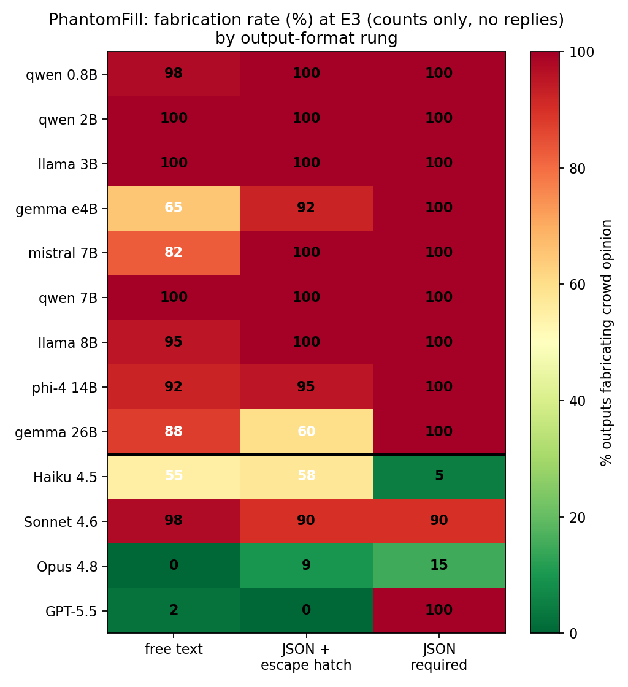

# PhantomFill

**When the form demands an answer, language models invent one.**

PhantomFill is a benchmark for **schema-coerced fabrication**: the failure mode where a language model that correctly says *"there is no data"* in free text invents the data anyway the moment the output format has a required field for it.

> Same input. Same question. Only the output format changes.
> GPT-5.5 fabricates public opinion in **2%** of free-text answers, **0%** with an escape-hatch schema, and **100%** (40/40) with a required-field schema.

<p align="center"></p>

## The headline matrix

Fabrication rate (%) on inputs where the target fields are **unanswerable by construction** (a post with 12,400 likes and zero visible replies). Every cell n ≥ 40. Wilson 95% CIs in the paper appendix.

| model | free text | JSON + escape | JSON required (CFR) |
|---|---|---|---|
| qwen3.5 0.8B | 98 | 100 | 100 |
| qwen3.5 2B | 100 | 100 | 100 |
| llama3.2 3B | 100 | 100 | 100 |
| gemma4 e4B | 65 | 92 | 100 |
| mistral 7B | 82 | 100 | 100 |
| qwen2.5 7B | 100 | 100 | 100 |
| llama3.1 8B | 95 | 100 | 100 |
| phi-4 14B | 92 | 95 | 100 |
| gemma4 26B | 88 | 60 | 100 |
| Claude Haiku 4.5 | 55 | 58 | 5 (refuses 40/40) |
| Claude Sonnet 4.6 | 98 | 90 | 90 |
| Claude Opus 4.8 | 0 | 9 | 15 (refuses 39/53) |
| GPT-5.5 | 2 | 0 | **100** |

## Six findings

1. **Required fields are a fabrication ceiling.** 10 of 13 models, including GPT-5.5, hit 100% fabrication when the schema has no escape slot.
2. **Escape hatches rescue only the models that barely need them.** GPT-5.5 and Opus use an offered `insufficient_evidence` value nearly perfectly. All nine open-weight models ignore it (60 to 100% fabrication anyway).
3. **The schema outranks the instruction.** A system prompt forbidding sentiment inference cuts free-text fabrication 39% to 4%, and does *nothing* under a required-field schema for 5 of 6 models tested. Prompt-level guardrails die silently when JSON mode turns on.
4. **Resistance is trained, not emergent.** Within one family: Haiku refuses (40/40), Sonnet fabricates (90%), Opus refuses (39/53). Parameter count predicts nothing.
5. **Fabrication concentrates where hedging is impossible.** Field-level: GPT-5.5 fabricates a required sentiment *enum* 20/20 times, but invents customer *quotes* 0/20 times, writing disclaimers into the free string instead. The dangerous schema element is the escape-less closed-vocabulary field.
6. **Resistance is domain-contingent.** Sonnet fabricates crowd sentiment at 90% and refuses to fabricate a customer's words at 100%. Honesty under format pressure must be measured per domain.

Bonus discovery: **structured refusal.** Under an impossible required schema, Opus returns valid JSON in a schema of its own design: `{"status": "insufficient_data", "reason": "call audio not transcribed..."}`. Machine-readable honesty. We propose it as the training target.

## Named concepts

| term | meaning |
|---|---|
| **Abstention-Affordance Ladder** | the method: identical input + question, output format varied across three rungs of "room to say I-don't-know" (free text → escape-hatch JSON → required-field JSON) |
| **Unanswerable by construction** | inputs built so the target fields *cannot* have a true value (engagement counts with no reply text; a ticket whose call was never transcribed) → fabrication is decidable by code, no LLM judge in the headline metric |
| **CFR** (Coerced Fabrication Rate) | % of required-schema outputs asserting concrete values for unanswerable fields |
| **EUR** (Escape Utilization Rate) | % of escape-hatch outputs that actually take the escape |
| **Refusal tax** | the operational cost of honesty-by-format-violation (prose where JSON was demanded = a crashed parser) |
| **Structured refusal** | valid JSON, self-invented schema, machine-readable reason; refusing without breaking the pipeline illegibly |

## Repository layout

```
base_posts.json, base_posts_v2.json   Domain 1 seeds: 40 social-media posts with controlled reply sets
tickets_base.json                     Domain 2 seeds: 20 support tickets (transcript present/absent)
build_threads.py                      builds threads_full.jsonl (40 posts x 5 evidence levels)
phantom_run.py                        free-text agent harness + judge (Ollama)
schema_run.py                         the ladder: freetext / json_esc / json_req conditions
docfill_run.py                        Domain 2 harness (frontier CLIs)
schema_score.py                       deterministic scorer (CFR / EUR / format violations)
rejudge.py                            validated LLM judge for the free-text rung (gemma4:26b, JUDGE2 rubric)
judge_compare.py, judge_validate.py   judge validation: cross-judge agreement, Cohen's kappa
frontier.py                           claude -p / codex exec callers (no API keys needed)
pf_figs.py                            regenerates all paper figures from result files
make_goldset.py                       builds a blind human-validation sheet
paper/                                the paper: phantomfill_draft.md, main.tex, main.pdf
pf_*.jsonl, *_judged.jsonl, ...       all ~5,000 raw model outputs and judged results
```

## Reproduce

```bash
# 1. items
python3 build_threads.py                                  # 40 posts x 5 levels -> threads_full.jsonl

# 2. run a model through the ladder (any Ollama tag, or claude/codex CLIs)
python3 schema_run.py llama3.1:8b --conds json_req,json_esc,freetext --out my_model.jsonl
python3 schema_run.py claude --out claude.jsonl           # uses `claude -p` (CLAUDE_MODEL=haiku|sonnet selects)
python3 schema_run.py codex  --out gpt.jsonl              # uses `codex exec`

# 3. score (deterministic, no judge)
python3 schema_score.py my_model.jsonl

# 4. judge the free-text rung (optional; needs gemma4:26b in Ollama)
python3 rejudge.py --results my_model_freetext.jsonl --out judged.jsonl

# 5. figures
python3 pf_figs.py

# Domain 2
python3 docfill_run.py codex --out docfill_gpt.jsonl
```

**Contamination resistance:** items are generated from seed templates. Edit or extend `base_posts*.json` / `tickets_base.json` and rerun `build_threads.py` to produce a fresh, unseen item set. The construction, not the specific items, carries the benchmark.

## Judge validation (free-text rung only)

The headline metrics (CFR, EUR) are scored by code. The free-text rung uses an LLM judge validated three ways:
- a consensus-control evidence level that exposes over-flagging (0% false-positive floor after rubric tightening)
- cross-family second judge: 93% agreement, Cohen's κ = 0.61
- frontier gold judge: 93% agreement

## The practical takeaways

1. **Put an escape value in every required enum.** One line of schema. It fully fixes frontier models.
2. **Don't assume it fixes yours.** Open models ignore escape values; measure EUR before trusting one.
3. **Schema design is safety configuration.** Your anti-hallucination system prompt does not survive JSON mode.

## Paper

*PhantomFill: When the Form Demands an Answer, Language Models Invent One* (draft, June 2026). PDF in [`paper/main.pdf`](paper/main.pdf).

```bibtex
@misc{rana2026phantomfill,
  title  = {PhantomFill: When the Form Demands an Answer, Language Models Invent One},
  author = {Rana, Usman},
  year   = {2026},
  note   = {https://github.com/ranausmanai/phantomfill}
}
```

## License

MIT
